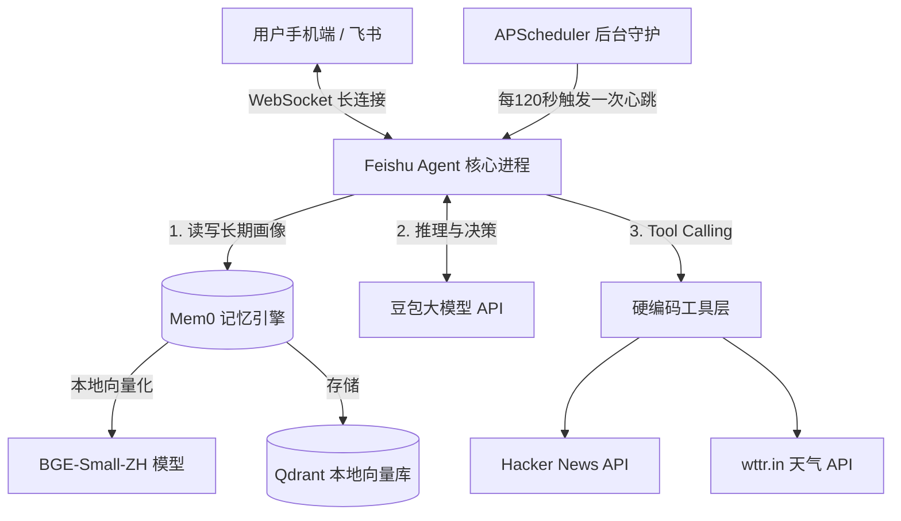

# KoalAgent (考拉特工) 架构演进与差距分析报告

## 1. 阶段性成果：我们目前构建了什么？

在极短的时间内，我们成功从零搭建了一个具备**“心智雏形”**的本地化中文 Agent (MVP 版本)。它脱离了传统的“单轮问答机器”范畴，迈入了“自主智能体”的门槛。

### 当前架构解剖 (MVP)

**我们已具备的核心能力：**
1. **身份持久化 (Persistence)**：通过 Mem0，Agent 拥有了跨越会话的记忆，能持续积累用户的偏好（Persona）。
2. **主动性 (Proactivity)**：不再被动等待指令，心跳机制让其具备了时间感知和主动关怀能力。
3. **真实世界触角 (Tool Use)**：突破了大模型的信息茧房，能抓取实时数据。

---

## 2. 竞品差距深度剖析 (Gap Analysis)

对比目前业内最前沿的两个开源 Agent 标杆 —— **OpenClaw** 与 **Hermes-Agent**，我们目前的形态处于“婴儿期”。以下是维度的详细对比：

### 🆚 对比 OpenClaw (主打：本地系统控制权)

OpenClaw 强调**“Local-First”**和**“系统级操作”**。它不仅仅是一个聊天助手，而是你的“电脑操作员”。

| 维度 | 我们的 MVP | OpenClaw | 演进难度 |
| :--- | :--- | :--- | :--- |
| **工具自由度** | 只能调用预先硬编码好的 2 个 Python API 函数。 | **无限。** 拥有原生 `bash/shell` 执行和文件读写权限。想干嘛就干嘛。 | 🌟🌟🌟 (中) |
| **环境互动** | 仅获取 API 数据。 | 可以运行本地脚本、操作文件树、甚至通过配置实现 UI 点击。 | 🌟🌟🌟🌟 (高) |
| **底层形态** | 依赖特定的 Python 环境和脚本运行。 | 通常打包为无头常驻网关，对接各种本地资源。 | 🌟🌟 (低) |

> [!WARNING]
> **最大差距点：Code Interpreter（代码解释器）**
> OpenClaw 之所以强大，是因为它内置了代码沙盒。当它遇到我们没写过的新任务时，它会**自己现场写一段 Python 代码并在你电脑上运行**。而我们的 Agent 遇到没写过的任务时，只能道歉。

### 🆚 对比 Hermes-Agent (主打：自我进化与复杂推理)

Hermes-Agent（由 Nous Research 开发）的内核更接近于“AGI 早期形态”，强调**多步推理**和**记忆的自我提纯**。

| 维度 | 我们的 MVP | Hermes-Agent | 演进难度 |
| :--- | :--- | :--- | :--- |
| **记忆处理** | 原生提取（用户说啥记啥）。 | **反思与提纯（Reflection）**。会在后台分析错题本，将过去的错误提炼成“未来不要再犯”的经验法则。 | 🌟🌟🌟🌟 (高) |
| **任务规划** | 单次思考 (Single-shot prompt)。直接决定调用啥工具并输出。 | **多步规划 (Plan & Solve)**。面对复杂任务会先列 TODO List，然后分步执行，中途失败会重试。 | 🌟🌟🌟🌟🌟 (极高) |
| **并发协作** | 单例运行。 | **多智能体 (Multi-Agent)**。可以同时派生出 3 个子 Agent 并行查阅资料，最后由主 Agent 汇总。 | 🌟🌟🌟🌟 (高) |

---

## 3. 演进路线图 (Roadmap to V2.0)

要将目前的 MVP 升级为比肩 OpenClaw/Hermes 的顶级个人助理，我们接下来的技术演进可以分为三个阶段。

### 🚀 Phase 1: 解放双手 —— 引入代码解释器 (Code Interpreter)
**目标**：让 Agent 能够自己写代码解决问题，彻底消除“硬编码工具”的限制。
**实施方案**：
1. 在 Python 中引入一个安全的沙盒环境（或直接暴露安全的 `subprocess`）。
2. 向大模型注册一个超级工具：`execute_python_code(code: str)`。
3. **效果**：下次你让它查股票，它会自己 `pip install yfinance` 然后跑出 K 线图发给你。

### 🧠 Phase 2: 大脑升级 —— 引入反思机制与规划器 (Reflection & Planner)
**目标**：赋予 Agent 纠错能力和处理长线任务的能力。
**实施方案**：
1. 引入类似于 LangChain/LangGraph 或 AutoGen 的框架重构主循环。
2. 每次心跳不再只是“单次对话”，而是一个**工作流**（评估问题 -> 制定计划 -> 执行 -> 验证结果 -> 不对就重试）。
3. 增加错题本机制：如果用户回复“你做错了”，Agent 会触发特定的记忆库更新。

### 🤖 Phase 3: 多模态与物理入侵 —— Computer Use
**目标**：让它具备感知 UI 的能力。
**实施方案**：
1. 接入 Playwright 库，赋予其操纵无头浏览器的能力。
2. 接入截图 API，让它可以截取你的屏幕发送给多模态大模型分析。
3. **效果**：你可以对它说：“帮我登录后台系统把今天的订单数据下载下来发到飞书”，它会在后台默默控制浏览器完成一切。

---

## 4. 结论与下一步行动建议

目前我们的框架非常稳固且极具拓展性。**我建议我们将 `Phase 1: 引入代码解释器` 作为下一个突破口。** 这也是性价比最高、最能让你感受到“Agent 质变”的一步。

一旦完成 Phase 1，你的机器人就不再需要你亲手为它写任何接口代码了，它将拥有“给自己制造工具”的终极能力。
